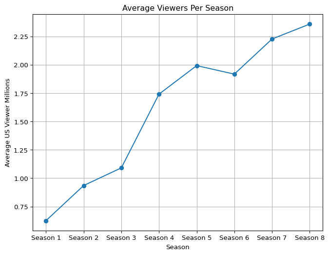
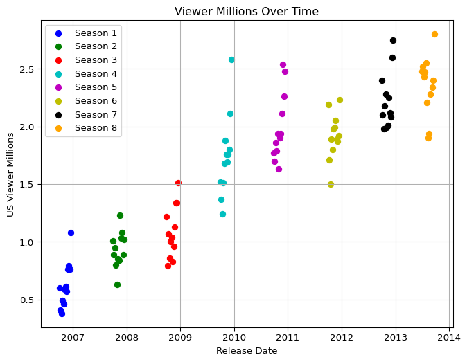

# Dexter Report
Husnain Mustafa
2024-04-15

# Introduction:

*Dexter* is an American television drama that was broadcast on the
premium cable channel *Showtime* from October 1, 2006, to September 22,
2013. A total of 96 episodes of Dexter were broadcast over eight
seasons.

The series is based on characters created by *Jeff Lindsay* for his
“Dexter” series of novels, and follows the life of Dexter Morgan
(Michael C. Hall), a Miami Metro Police Department blood pattern analyst
with a double life. While investigating murders in the homicide
division, Dexter hunts and kills murderers and criminals who have
escaped the justice system. Although the first season is based on the
events of Darkly Dreaming Dexter, the series’ subsequent seasons do not
follow the novels in the series. Departing from the narrative of
Lindsay’s second Dexter novel Dearly Devoted Dexter, the show’s writer
Daniel Cerone said that the writers “didn’t see the opportunity in the
second book” to adapt it.

## Poster:

## Overall Average Viewership:

Over 8 million weekly viewers across all platforms for the entire
series, including “Dexter: New Blood”. This makes it the most-watched
series in Showtime’s history. Viewership grew steadily throughout the
original series run. Season 1 averaged 0.63 million viewers, while
Season 8 averaged 2.36 million viewers. The season 4 finale holds the
record for the most-watched original series episode on Showtime at the
time, with 2.6 million viewers. Despite being the most-watched series in
Showtime history, “Dexter: New Blood” averaged a lower viewership of
0.59 million viewers per episode. However, its finale set a record for
Showtime with 3 million viewers across all platforms, including 2
million via streaming and on-demand.

## Viewership Over Time:

Beow graph shows average viewers over ach season of the show.

# Popularity Per Episode:

This plot shows the viewership of the show over the years. With each
season highlightes and each episode as a distinct point.

# Season Viewership Analysis:

The *Dexter* series has shown a remarkable trend in viewership over its
eight-season run. The analysis below utilizes inline variables to
summarize key insights from the viewership data.

## Summary of Viewership Trends:

- **Starting Strong:** The series began with a solid viewership, with
  Season 1 averaging 0.62 million viewers.
- **Peak Popularity:** Dexter reached its peak popularity in Season 4,
  with an average of 1.74 million viewers.
- **Consistent Growth:** There was a consistent growth in viewership
  from Season 1 through Season 4.
- **Sustaining Interest:** While there were fluctuations, the series
  maintained a strong audience, with Season 8 averaging 2.36 million
  viewers.
- **Series Finale:** The series finale saw a significant spike in
  viewership, drawing 2.8 million viewers across all platforms.

## Insights from the Data:

- The viewership data indicates that the series was able to capture and
  retain a large audience throughout its run.
- The increase in viewership over time suggests that the show grew in
  popularity as it progressed, likely due to word-of-mouth and increased
  marketing efforts.
- The drop in viewership for “Dexter: New Blood” could be attributed to
  various factors such as changes in viewing habits, competition from
  other shows, or the long gap between the original series and the
  revival.

## Conclusion:

Dexter’s journey through the years has been a testament to its
compelling storytelling and strong character development. The data
reflects the show’s ability to engage viewers, making it a standout
series in Showtime’s lineup.
